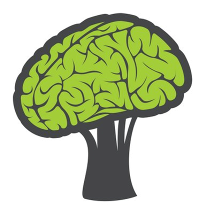

[![Contributors][contributors-shield]][contributors-url]
[![Forks][forks-shield]][forks-url]
[![Stargazers][stars-shield]][stars-url]
[![Issues][issues-shield]][issues-url]
[![MIT License][license-shield]][license-url]
[![LinkedIn][linkedin-shield]][linkedin-url]

<!-- PROJECT LOGO -->
 

  

  <h3 align="center"> Broccoli Lab </h3>

  

    Molecular NeuroEngineering Laboratory San Raffaele Hospital - CNR-Institute of Neuroscience
  

<!-- TABLE OF CONTENTS -->

  
Table of Contents

  <ol>
  <li>
      <a href="#about-the-project">About the project</a>
    </li>
    <li>
      <a href="#about-the-project">Pipelines</a>
    </li>
    <li>
      <a href="#Getting Started">Data sets</a>
      <ul>
        <li><a href="#Bulk">Bulk</a></li>
        <li><a href="#Single cell">Single cell</a></li>
        <li><a href="#Documentation">Documentation</a></li>
      </ul>
    </li>
    <li><a href="#contact">Contact</a></li>
  </ol>

<!-- ABOUT THE PROJECT -->
## About The Project

Neurological diseases affect profoundly society at every level causing a severe burden to patients and families. Thought the last years have witnessed an unprecedented gain in knowledge on their pathophysiological bases, this has not yet led to a transformation of clinical interventions and their curative potential. In fact, neurological disorders pose additional great challenges hidden in the magnificent complexity of the cellular architecture and relative isolation of the brain tissue and the yet uncompleted understanding of its mechanisms of function. To contribute to overcome these hurdles, we are developing new humanized models of neurological diseases employing the patient iPSC-derived human neural cells, organoids and microfluidic-organized neuronal circuitries. Moreover, we are working in improving gene-based therapies to correct gene mutations and restore correct gene expression in the brain to halt disease progression or even prevent the onset of the pathology. To reach these goals, we are generating novel therapeutic viral capsids, optimizing administration routes and advancing CRISPR/Cas9 gene editing tools for safe and efficient gene repair in neural tissues. These activities are intimately associated to further progress our understanding of the neurological diseases and untangle the early molecular dysfunctions that contribute to pathological progression. On this aspect, we are interested to comprehend the basis of vulnerability of certain neuronal populations to specific diseases and understand the different degrees of plasticity of neuronal cells during aging and cellular reprogramming.

<!-- GETTING STARTED -->
## Pipelines
some to write
### Prerequisites

To run margheRita you need [R](https://www.r-project.org/) version $\ge$ 3.8

<!-- Pipelines -->

<!-- CONTACT -->
## Contacts

Edoardo Bellini

Mattia Zaghi

Alessandro Sessa

<!-- MARKDOWN LINKS & IMAGES -->
<!-- https://www.markdownguide.org/basic-syntax/#reference-style-links -->
[contributors-shield]: https://img.shields.io/github/contributors/othneildrew/Best-README-Template.svg?style=for-the-badge
[contributors-url]: https://github.com/othneildrew/Best-README-Template/graphs/contributors
[forks-shield]: https://img.shields.io/github/forks/othneildrew/Best-README-Template.svg?style=for-the-badge
[forks-url]: https://github.com/othneildrew/Best-README-Template/network/members
[stars-shield]: https://img.shields.io/github/stars/othneildrew/Best-README-Template.svg?style=for-the-badge
[stars-url]: https://github.com/othneildrew/Best-README-Template/stargazers
[issues-shield]: https://img.shields.io/github/issues/othneildrew/Best-README-Template.svg?style=for-the-badge
[issues-url]: https://github.com/othneildrew/Best-README-Template/issues
[license-shield]: https://img.shields.io/github/license/othneildrew/Best-README-Template.svg?style=for-the-badge
[license-url]: https://github.com/othneildrew/Best-README-Template/blob/master/LICENSE.txt
[linkedin-shield]: https://img.shields.io/badge/-LinkedIn-black.svg?style=for-the-badge&logo=linkedin&colorB=555
[linkedin-url]: https://linkedin.com/in/othneildrew
[product-screenshot]: images/screenshot.png
